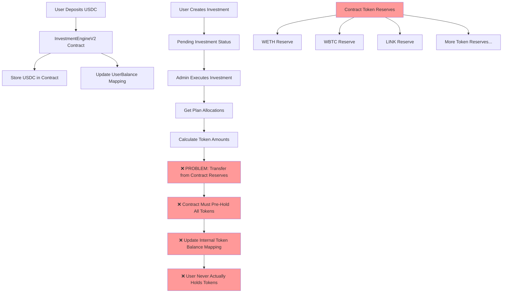
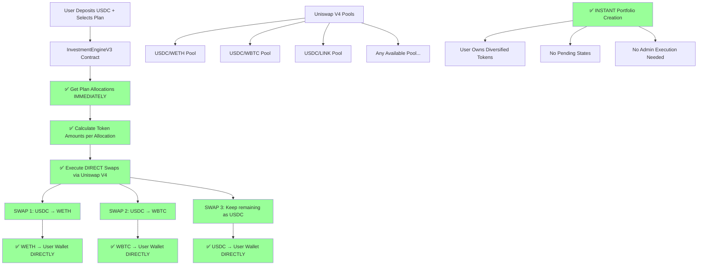
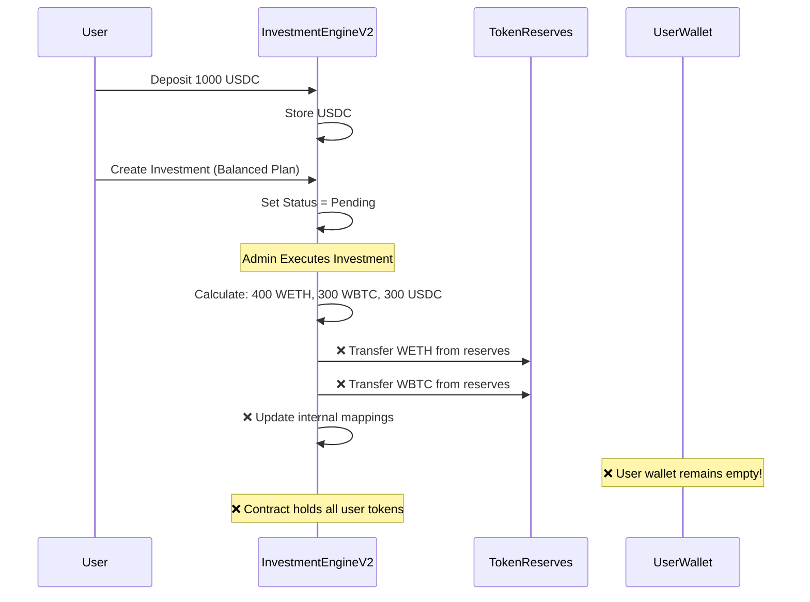
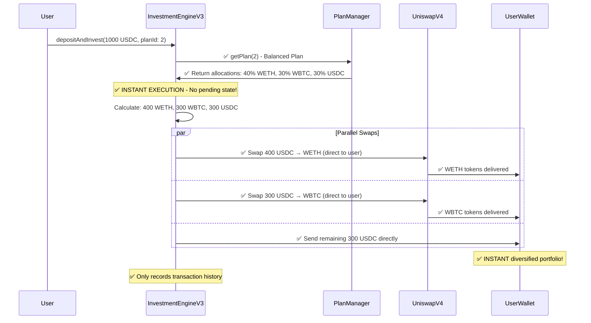
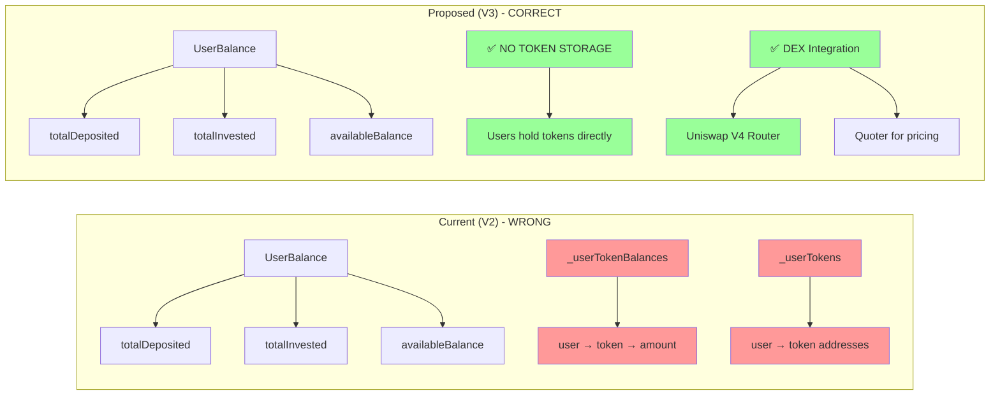
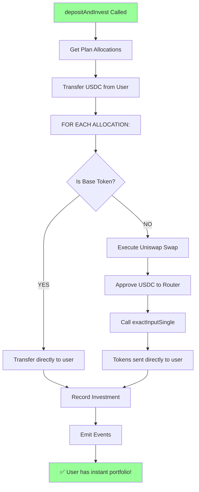

# DEX Integration Architecture - Before vs After

## Current Architecture (InvestmentEngineV2) - PROBLEMATIC ❌



## Proposed Architecture (InvestmentEngineV3) - DIRECT DEX SWAPS ✅



## Detailed Flow Comparison

### Current Flow (BROKEN) ❌



### Proposed Flow (INSTANT SWAPS) ✅



## Key Technical Changes

### Data Structure Changes



## Benefits of INSTANT DEX Integration

| Aspect | Current (V2) | Proposed (V3) |
|--------|-------------|---------------|
| **Execution Speed** | ❌ Deposit → Pending → Admin Execute | ✅ **INSTANT**: Deposit + Invest in 1 TX |
| **Token Ownership** | ❌ Contract holds tokens | ✅ Users hold tokens directly |
| **Capital Efficiency** | ❌ Requires pre-funding reserves | ✅ Uses DEX liquidity |
| **Scalability** | ❌ Limited by reserve size | ✅ Unlimited via DEX pools |
| **User Experience** | ❌ Multi-step process + waiting | ✅ **ONE-CLICK** portfolio creation |
| **Security** | ❌ Single point of failure | ✅ Distributed risk |
| **Admin Dependency** | ❌ Requires admin intervention | ✅ **FULLY AUTOMATED** |
| **Gas Efficiency** | ❌ Multiple transactions | ✅ **SINGLE TRANSACTION** |

## New Core Function: `depositAndInvest`



## Key Implementation Changes

### New Function Signature
```solidity
function depositAndInvest(
    uint256 amount,
    uint256 planId,
    DepositType depositType
) external returns (uint256 investmentId)
```

### Removed Functions
- ❌ `executeInvestment()` - No longer needed
- ❌ `batchExecuteInvestments()` - No longer needed
- ❌ Investment pending states - Everything is instant
- ❌ Token balance tracking - Users hold tokens directly

This architecture transformation creates a **TRUE ONE-CLICK DeFi INVESTMENT PLATFORM** where users get instant diversified portfolios without any centralized custody or admin dependencies.