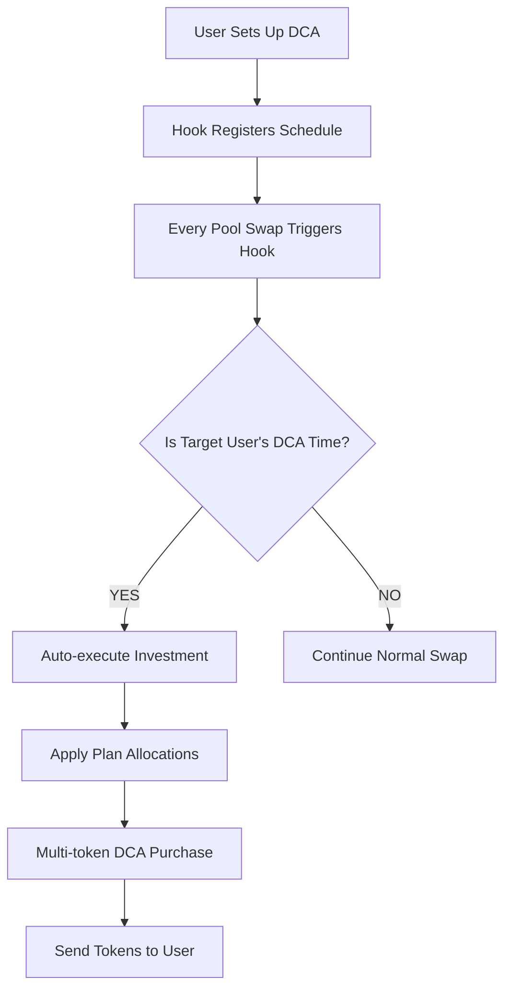
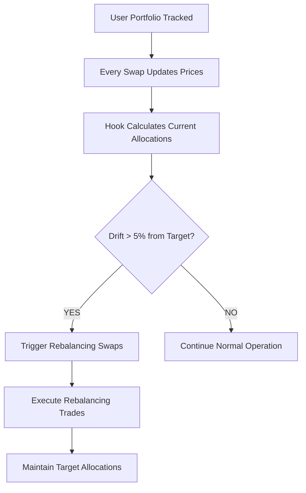
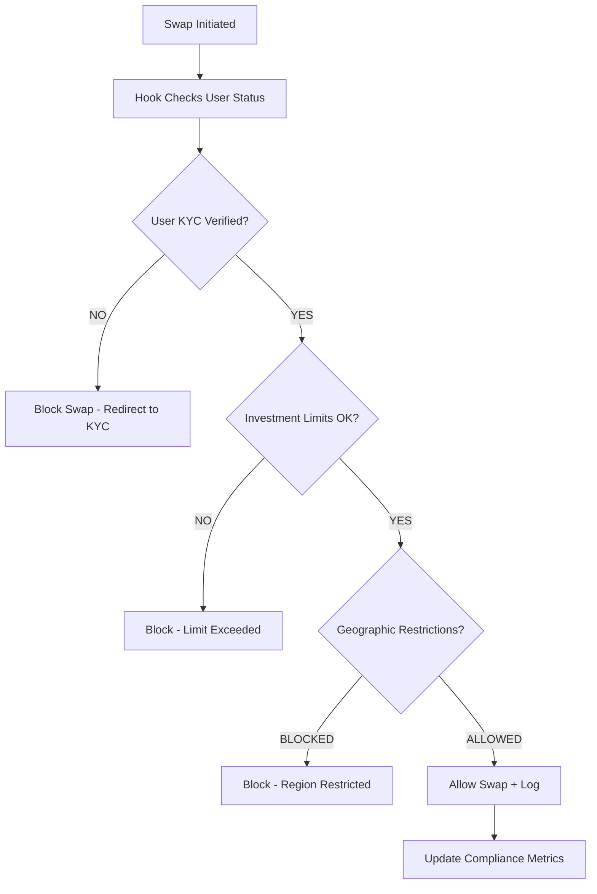
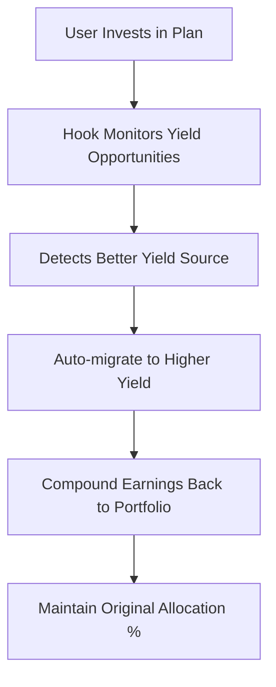
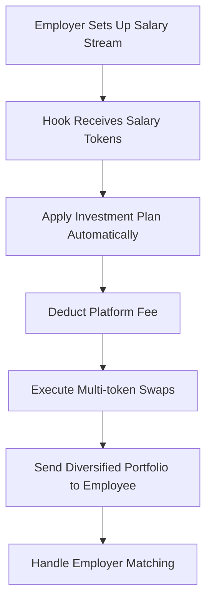
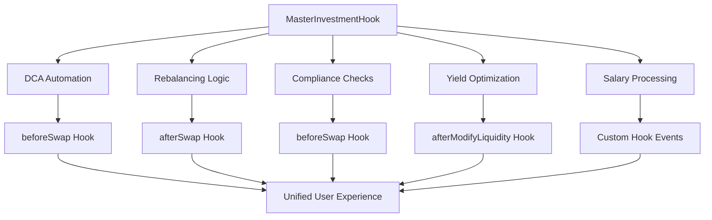
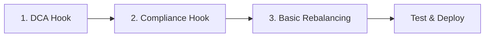
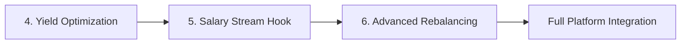
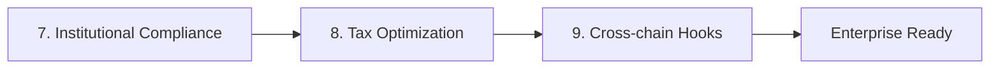

# Uniswap V4 Hooks for 404 Poverty Not Found Platform

## 🎯 Strategic Hook Ideas for Investment Platform

### 1. **DollarCostAveraging Hook** 🔄
**Most Valuable for Your Platform**



**Implementation:**
- Hook triggers on `beforeSwap` or `afterSwap`
- Maintains user DCA schedules in hook storage
- Automatically executes investments when conditions met
- Perfect for salary-based recurring investments

### 2. **RebalancingHook** ⚖️
**Automatic Portfolio Rebalancing**



**Features:**
- Monitor portfolio drift in real-time
- Auto-rebalance when thresholds exceeded
- Gas-efficient by piggy-backing on existing swaps
- Maintains optimal risk exposure

### 3. **ComplianceHook** 🛡️
**KYC/AML and Regulatory Compliance**



**Critical for RWA Integration:**
- Real-time KYC verification
- Investment limit enforcement
- Geographic restrictions
- Audit trail for regulators

### 4. **YieldBoostHook** 💰
**Automatic Yield Optimization**



**Features:**
- Auto-stake idle tokens in highest yield protocols
- Compound earnings back into portfolio
- Maintain allocation percentages
- Maximize returns without user intervention

### 5. **SalaryStreamHook** 💳
**Automated Salary-Based Investing**



**Perfect for Your Use Case:**
- Automated salary-based investments
- Employer matching integration
- Vesting schedule support
- Tax-efficient processing

## 🏗️ Advanced Hook Combinations

### **Master Investment Hook** - Combines Multiple Features



## 🔧 Technical Implementation Strategy

### Hook Architecture

```solidity
contract PovertyNotFoundHook is BaseHook {
    using PoolIdLibrary for PoolKey;

    struct UserInvestment {
        uint256 planId;
        uint256 lastDCATime;
        uint256 dcaAmount;
        uint256 dcaInterval;
        bool rebalancingEnabled;
        uint256 lastRebalanceTime;
    }

    mapping(address => UserInvestment) public userInvestments;
    mapping(PoolId => bool) public monitoredPools;

    function beforeSwap(
        address sender,
        PoolKey calldata key,
        IPoolManager.SwapParams calldata params,
        bytes calldata hookData
    ) external override returns (bytes4) {
        // 1. Compliance checks
        _checkCompliance(sender);

        // 2. Check for DCA triggers
        _processDCA(sender, key);

        // 3. Monitor for rebalancing needs
        _checkRebalancing(sender, key);

        return BaseHook.beforeSwap.selector;
    }

    function afterSwap(
        address sender,
        PoolKey calldata key,
        IPoolManager.SwapParams calldata params,
        BalanceDelta delta,
        bytes calldata hookData
    ) external override returns (bytes4) {
        // 1. Update price feeds for rebalancing
        _updatePriceFeeds(key, delta);

        // 2. Execute any triggered rebalancing
        _executeRebalancing(sender);

        // 3. Log for compliance
        _logTransaction(sender, key, delta);

        return BaseHook.afterSwap.selector;
    }
}
```

## 🎯 Recommended Implementation Priority

### Phase 1: Core Investment Hook


### Phase 2: Advanced Features


### Phase 3: Enterprise Features


## 💡 Hook Benefits for Your Platform

| Feature | Traditional DEX | With Custom Hooks |
|---------|----------------|-------------------|
| **Investment Execution** | Manual, multiple TXs | ✅ Automated, single TX |
| **Rebalancing** | User-initiated | ✅ Automatic drift detection |
| **Compliance** | Off-chain checks | ✅ Real-time on-chain enforcement |
| **DCA** | Separate protocol needed | ✅ Built into every swap |
| **Yield** | Manual optimization | ✅ Auto-optimization |
| **Gas Costs** | High (multiple TXs) | ✅ Low (piggyback on swaps) |

## 🚀 Unique Value Propositions

1. **First DeFi Investment Platform with Native Uniswap V4 Integration**
2. **Automatic Compliance for RWA Investments**
3. **Zero-Click Portfolio Management**
4. **Enterprise-Grade Salary-Based DeFi**
5. **Regulatory-Compliant Automated Investing**

## 🔥 Hackathon Demo Ideas

### Live Demo Flow:
1. **User deposits salary** → Hook auto-invests in selected plan
2. **Market moves** → Hook automatically rebalances
3. **Compliance check** → Hook enforces limits in real-time
4. **Yield opportunity** → Hook migrates to higher yield
5. **Result**: Fully automated, compliant, optimized portfolio

This would be **groundbreaking** - the first platform to combine investment automation, compliance, and yield optimization all through Uniswap V4 hooks!